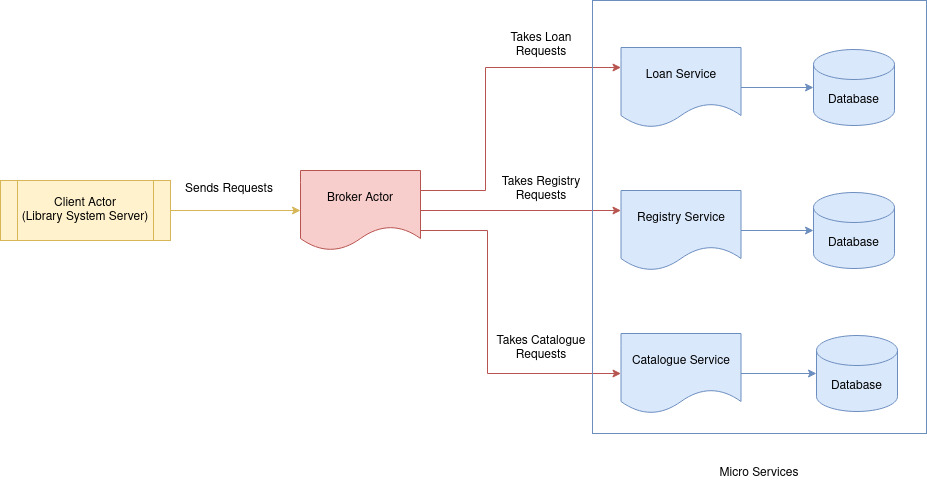

# Quoco Pops


[Demonstration Video](https://drive.google.com/file/d/1hsCVWqkPsvjnu1OYBq6HGCEuthu1uTxu/view?usp=sharing)





A microservices system that offers a back-end library system. Our system offers three services built with akka actors that:

1. Regsiter/deletes/updates Users
2. Regsiter/deletes/updates Loans
3. Regsiter/deletes/updates Books

This system is scalable to accommodate multiple libraries and designed to perform under load from its clients.

The system has been configured to run locally with docker-compose and AWS RDS. See below, how to run the system.

## Running the system locally

### Running via docker-compose

First, from the root of the repository, install all dependencies and build the jars with maven:
```
mvn clean install
```

Then you can build the docker images and finally, run them:
```
docker-compose build
docker-compose up
```
